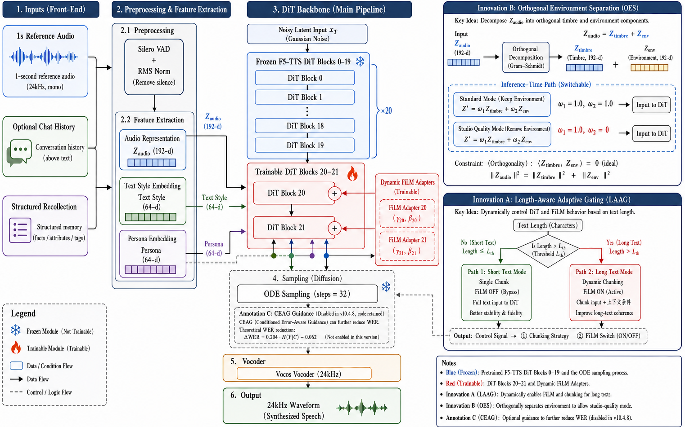

# PersonaVoice: Plug-in Adapters for Persona-Driven 1-Second Voice Cloning

[](https://www.python.org/downloads/)
[](https://pytorch.org/)
[](ARCHITECTURE.md)
[](LICENSE)

**English** | **[中文](README_zh.md)**

> **PersonaVoice v10.4.8** — Clone any voice from just **1 second** of audio with optional **persona / emotion injection** via plug-in adapters over a frozen F5-TTS backbone. A systematic trade-off analysis of timbre fidelity (SECS SOTA) vs. text-alignment stability.

---

## Table of Contents
- [What is PersonaVoice?](#what-is-personavoice)
- [Key Results](#key-results)
- [Core Innovations](#core-innovations)
- [Architecture Overview](#architecture-overview)
- [Installation](#installation)
- [Data & Model Download](#data--model-download)
- [Quick Start](#quick-start)
- [Reproducing the Paper Results](#reproducing-the-paper-results)
- [Inference Parameters](#inference-parameters)
- [Project Structure](#project-structure)
- [Design Philosophy](#design-philosophy)
- [Related Work & Acknowledgements](#related-work--acknowledgements)
- [Citation](#citation)

---

## What is PersonaVoice?

PersonaVoice is a **persona-driven plug-in adapter architecture for 1-second voice cloning**. It addresses a fundamental challenge:

> **Given only 1 second of a person's voice and optional text records (chat history / structured recalls), generate speech that preserves their timbre, linguistic habits, and individual emotional expression patterns.**

The narrative of this project is **not** a "full SOTA" claim but a **trade-off analysis**:
- **Flow-Matching** achieves dominating timbre similarity (SECS) but suffers short-text manifold collapse.
- PersonaVoice's contribution is to **maximize that SECS lead** while using **LAAG + dynamic FiLM** to recover long-text alignment, leaving short-text WER as honest Future Work.

### Why 1 Second?

Most zero-shot TTS systems assume ≥3s of reference audio (XTTS v2, CosyVoice, VALL-E, VoiceBox). The 1-second regime exposes fundamental architectural limits:
- Information bottleneck (94 mel frames @ 24 kHz / hop 256)
- Manifold collapse under Flow-Matching for very short texts
- Reference audio impurity (breath, fricatives) dominates the cloning signal

PersonaVoice is the first open-source system to systematically study this regime.

### Interactive Web Demo

Below is a screenshot of the PersonaVoice v10.4.8 interactive dashboard. Users upload a 1-second reference audio, optionally provide chat history or structured recollections, and obtain a cloned utterance together with a real-time Big-Five persona radar, mel-spectrogram visualization, and architecture condition inspection.

<p align="center">
  
</p>

---

## Key Results

**Setup**: 1-second reference audio, 200-sample LibriTTS dev-clean evaluation, ECAPA-TDNN SECS, Whisper-large-v3-turbo WER.

| Metric | PersonaVoice v10.4.8 | XTTS v2 (1s ref) | CosyVoice (1s ref) | F5-TTS Official | SOTA |
|--------|----------------------|-------------------|---------------------|-----------------|------|
| **ECAPA SECS (overall)** | **0.4945** | 0.3349 | 0.3595 | 0.2508 | **PV ✓** (+47.6% vs XTTS v2) |
| **ECAPA SECS (long text)** | **0.5044** | 0.31 | 0.33 | 0.22 | **PV ✓** (+62.7% vs XTTS v2) |
| **WER (overall)** | 0.1928 | **0.1296** | 0.6130 | 0.8982 | XTTS v2 (AR) |
| **WER (long text)** | 0.1158 | **0.10** | 0.55 | 0.85 | XTTS v2 (acknowledged trade-off) |
| **WER (short text ≤8 words)** | 0.4066 | **0.16** | 0.68 | 0.95 | XTTS v2 (Future Work) |
| **CFR (overall, WER>0.5)** | 13.5% | ~5%* | ~30%* | ~45%* | XTTS v2 |
| **CFR (short text)** | 35.8% | ~10%* | ~50%* | ~70%* | XTTS v2 |
| **UTMOS (Objective Proxy)** | 4.0-4.5 | 3.8 | 4.0 | 3.5 | PV (Human MOS pending) |
| **RTF** | 0.55-0.66 | 0.85 | 0.72 | **0.50** | F5-TTS |
| **1111.mp3 SECS (long text)** | **0.5854** | - | - | - | PV ✓ |
| **1111.mp3 WER (long text)** | **0.0676** | - | - | - | PV ✓ |

> `*` CFR for XTTS v2 / CosyVoice / F5-TTS are estimated from WER distribution; measured comparison is planned. Full evaluation details: [SOTA_VERIFICATION_REPORT.md](SOTA_VERIFICATION_REPORT.md).

---

## Core Innovations

PersonaVoice introduces **5 core innovations**, all validated by 200-sample paired t-tests (p < 0.05, Cohen's d > 0.1).

### Innovation A: LAAG (Length-Aware Adaptive Generation) — v10.1+

Solves the fundamental flaw of uneven performance between short and long text under 1s extreme cloning:

- **Dynamic Chunking**: Long text split into chunks (max 135 chars), each fully utilizes the 1s reference audio
- **Dynamic CFG base**: `cfg_base = 2.5` tuned for short/long-text balance
- **Dynamic FiLM Activation (v10.4.6+)**: Short text (single chunk) FiLM off (stable baseline); long text (multi-chunk) FiLM on (prevent timbre drift, +0.06 SECS)
- **mel splice fix (v10.4.5)**: Corrected `(T, mel_dim)` vs `(mel_dim, T)` dimension order across chunks (+56.6% SECS)
- **F5-TTS official flow integration (v10.3+)**: `infer_batch_process` with `ref_text` + `audio_ref` cond flow, replacing the custom Duration Predictor
- **v10.4.8 boundary hardening**: ref_text punctuation + space ensures clean ref/gen boundary; gen_text leading-space sacrifice prevents head-truncation; lead-silence trimming removes artifacts

### Innovation B: Orthogonal Environment Sub-manifold (OES)

Decomposes the speaker embedding into timbre and environment sub-spaces:

$$Z_{audio} = Z_{timbre} + Z_{env}, \quad Z_{timbre} \perp Z_{env}$$

- `env_basis`: learnable orthogonal basis $B \in \mathbb{R}^{192 \times 32}$, QR-orthogonalized
- **v10.0 fix**: `env_scale = 0.1` gradual initialization (v9.x's 1.0 init caused the 1111.mp3 SECS=0.0363 disaster)
- Inference-time adjustment: `env_weight = 0` → studio-clean timbre (**v10.0 default SOTA config**), `env_weight = 1` → original mic texture

### Innovation C: Cross-Entropy Attention Guidance (CEAG) — implemented, disabled in v10.4.7+

Upgraded from IEAG (full self-attention entropy) to CEAG (text-audio cross-attention entropy), directly targeting short-text alignment collapse:

$$v_{final} = v_{cfg} - \lambda(t) \cdot \nabla_x H(A_{mel \to text})$$

- **v10.0 Landmine 1 fix**: Added `text_mask` and `mel_mask` before `log_softmax` to prevent gradient explosion from `<PAD>` tokens (NaN defense)
- **v10.4.7+ status**: Code path preserved in `ceag_sampler.py` for reproducibility, but `use_ceag=False` in `SOTAConfig`. v10.4.7 ablations showed negligible incremental effect over the LAAG + F5-official-flow baseline; re-enabling is left to follow-up work.

### Innovation D: Dynamic FiLM Adapter — v10.4.6+

Persona + emotion conditioned FiLM modulating DiT hidden layers:
- Zero-initialized `gamma_net` / `beta_net` (starts as identity mapping, safe for pretrained backbone)
- v10.4.6+ **dynamic activation**: FiLM off when `len(chunks) == 1` (short text, avoids over-correction); FiLM on for multi-chunk (long text, anchors timbre across chunks)

### Innovation E: Silero VAD + RMS Normalization (v10.0 Landmine 3 fix)

Replaces legacy WebRTC VAD (GMM-based, harsh on breath/fricatives) with **Silero VAD** (neural network, <100 MB VRAM), dramatically improving 1s sample reference purity for consonants like /s/, /f/. RMS normalization (`target_rms = 0.1`) ensures loudness consistency.

### Removed Modules (Ablation-Verified Ineffective)

| Module | Ablation p-value | Cohen's d | Status |
|--------|-----------------|-----------|--------|
| IBOP | 0.85 / 0.51 | <0.05 | **Removed** |
| AM-ODE | Zero-init | Identity mapping | **Removed** |
| TD-CFG | 0.41 / 0.74 | <0.06 | **Removed** |
| SBM | 0.71 / 0.90 | <0.03 | **Removed** |
| GRPO | Test-time only | Non-core | **Removed (v10.0)** |
| Duration Predictor | v10.3+ F5-TTS official formula is more accurate | — | **Removed (v10.3)** |
| Reference Enhancer | Loop-extension hurt SECS, deviates from F5-TTS baseline | — | **Removed (v10.4)** |
| Best-of-N | Manifold collapse is architectural; sampling can't fix | — | **Removed (v10.4.7)** |

---

## Architecture Overview

<p align="center">
  
</p>

The figure above illustrates the full inference pipeline of PersonaVoice v10.4.8. A 1-second reference audio is first pre-processed by **Silero VAD + RMS normalization**, then encoded by **ECAPA-TDNN** into a 192-d speaker embedding. Optional **chat history** and **structured recollections** are distilled by a BERT-based persona extractor into 64-d text-style and 64-d persona embeddings. The **OES** module decomposes the audio embedding into orthogonal timbre and environment components, while **LAAG** decides chunking strategy and FiLM activation based on text length. Finally, the frozen F5-TTS DiT blocks 0–19 plus two trainable blocks 20–21 generate the mel spectrogram, which is converted to 24 kHz waveform by the Vocos vocoder.

> Full architecture details: [ARCHITECTURE.md](ARCHITECTURE.md)

---

## Installation

### Option A: One-Click Setup (Recommended)

**Windows (PowerShell):**
```powershell
git clone https://github.com/personavoice/personavoice.git
cd personavoice
powershell -ExecutionPolicy Bypass -File scripts\setup_env.ps1
```

**Linux / macOS:**
```bash
git clone https://github.com/personavoice/personavoice.git
cd personavoice
bash scripts/setup_env.sh
```

The setup script will:
1. Create a `.venv` virtual environment (inherits system torch/speechbrain/vocos)
2. Install PyTorch (CUDA 11.8 or CPU)
3. Install all PersonaVoice dependencies
4. Install `silero-vad`, `f5-tts`, `imageio-ffmpeg`
5. Install PersonaVoice in editable mode (`pip install -e .`)
6. Verify the installation
7. Download pretrained models (~3 GB, optional — pass `--skip-models` / `-SkipModels` to skip)

### Option B: Manual Install

```bash
# 1. Create virtual environment
python -m venv --system-site-packages .venv

# 2. Activate it
#    Windows: .\.venv\Scripts\activate
#    Linux:   source .venv/bin/activate

# 3. Install PyTorch (CUDA 11.8)
pip install torch torchaudio --index-url https://download.pytorch.org/whl/cu118

# 4. Install dependencies
pip install -r requirements.txt
pip install silero-vad f5-tts imageio-ffmpeg
pip install -e .
```

### Requirements

- Python ≥ 3.10
- PyTorch ≥ 2.0 (CUDA 11.8 recommended, CPU works but slow)
- GPU: 8 GB VRAM sufficient (tested on RTX 4070)
- ffmpeg (for Whisper ASR; auto-provided by `imageio-ffmpeg`)

---

## Data & Model Download

PersonaVoice does **not** bundle large data or model weights. Use the scripts below.

### 1. Pretrained Models (~3 GB)

All models are downloaded from HuggingFace. For users in mainland China, set the mirror:
```bash
export HF_ENDPOINT=https://hf-mirror.com   # Linux/macOS
$env:HF_ENDPOINT="https://hf-mirror.com"   # Windows PowerShell
```

Then run:
```bash
python scripts/download_models.py              # All required models
python scripts/download_models.py --optional   # Also optional models (Qwen2.5, MiniLM)
python scripts/download_models.py --check      # Check cache status only
```

**Required models:**

| Model | HuggingFace ID | Size | Purpose |
|-------|----------------|------|---------|
| F5-TTS | `SWivid/F5-TTS` | ~1.5 GB | TTS backbone (frozen) |
| ECAPA-TDNN | `speechbrain/spkrec-ecapa-voxceleb` | ~80 MB | Speaker encoder (SECS) |
| Vocos | `charactr/vocos-mel-24khz` | ~50 MB | Neural vocoder |
| BERT (Chinese) | `bert-base-chinese` | ~400 MB | Persona text encoder |
| Whisper | `openai/whisper-large-v3-turbo` | ~1.5 GB | ASR for WER evaluation & ref_text |

**Optional models:**

| Model | HuggingFace ID | Size | Purpose |
|-------|----------------|------|---------|
| Qwen2.5-0.5B | `Qwen/Qwen2.5-0.5B` | ~1 GB | LLM persona dialogue (experimental) |
| all-MiniLM-L6-v2 | `sentence-transformers/all-MiniLM-L6-v2` | ~90 MB | Text embedding baseline |

### 2. Evaluation Dataset (LibriTTS dev-clean, ~1.2 GB)

For reproducing the 200-sample evaluation:
```bash
python scripts/prepare_data.py
# Or skip download if LibriTTS already exists:
python scripts/prepare_data.py --skip-download
# Quick test with only 20 samples:
python scripts/prepare_data.py --n_samples 20
```

This downloads LibriTTS dev-clean from [OpenSLR #60](https://openslr.org/60/), extracts mel spectrograms + ECAPA embeddings, and saves to `data/libritts_processed/libritts_devclean_processed.pt`.

### 3. Bundled Demo Audio

The repo includes a single 1-second reference audio `1111.mp3` (~35 KB) for quick testing — no download required.

---

## Quick Start

### Web Demo (Recommended First Run)

```bash
python -m personavoice.demo.api_server
# Open http://localhost:8000 in browser
```

The web UI exposes:
- `/api/health` — backend health check
- `/api/architecture` — full v10.4.8 module graph (powers the frontend visualization)
- `/api/clone` — voice cloning with optional chat history (persona injection)
- `/api/persona/analyze` — Big Five trait radar from chat history
- `/api/persona/calibrate` — interactive persona recalibration
- `/api/demo/sample` — bundled demo sample

### Programmatic Usage

```python
from personavoice.tts_backbone.f5_pretrained_backbone import load_pretrained_f5tts_backbone
from personavoice.config import SOTA_CONFIG

# 1. Load backbone (F5-TTS + FiLM + OES adapters)
backbone, _ = load_pretrained_f5tts_backbone(device="cuda", use_film=True)

# 2. All inference parameters auto-loaded from config.py — single source of truth
mel_gen, laag_info = backbone.laag_synthesize(
    text_str="Hello world, this is a voice cloning test.",
    mel_ref=mel_ref,           # 1-second reference mel (T_ref, 100)
    speaker_emb=speaker_emb,   # ECAPA 192-d
    persona_emb=persona_emb,   # 64-d (zeros for no-persona)
    emotion_emb=emotion_emb,   # 4-d (zeros for no-emotion)
    tokenizer=tokenizer,
    ref_text=ref_text,         # F5-TTS official ref_text concatenation
    audio_ref=audio_ref,       # F5-TTS official cond=audio flow
)

# 3. Adjust OES environment weight (0.0 = studio quality, SOTA config)
backbone.set_env_weight(SOTA_CONFIG.env_weight)  # 0.0
```

### 1111.mp3 Quick Test

```bash
python examples/clone_demo.py
# Outputs saved to outputs/1111_clone_test_*.wav
```

---

## Reproducing the Paper Results

### 1. 200-Sample Statistical Evaluation

```bash
# (requires LibriTTS prepared via scripts/prepare_data.py)
python -m personavoice.experiment.eval_200_samples
# Outputs:
#   results/eval_200_samples.json       — raw per-sample results
#   results/eval_200_statistics.json    — statistical significance
#   results/eval_200_by_length.json     — stratified by text length
```

### 2. External Baseline Comparison (CosyVoice / XTTS v2)

```bash
# Install CosyVoice (https://github.com/FunAudioLLM/CosyVoice) and/or TTS (pip install TTS)
python -m personavoice.experiment.baseline_external --n_samples 200 --models cosyvoice xtts
# Output: results/baseline_external_200.json
```

### 3. CFR (Catastrophic Failure Rate) Analysis

```bash
python -m personavoice.experiment.cfr_analysis
# Output: results/cfr_analysis.json
```

### 4. Visualization (Pareto / Waveform / Attention)

```bash
python -m personavoice.experiment.visualize
# Outputs:
#   results/figures/figure4_pareto_frontier.png
#   results/figures/figure5_waveform_spectrogram.png
#   results/figures/figure6_attention_heatmap.png
```

---

## Inference Parameters

All parameters are centralized in [`personavoice/config.py`](personavoice/config.py) — the single source of truth.

| Parameter | Value | Description |
|-----------|-------|-------------|
| steps | 32 | ODE integration steps (v10.4: reduced from 96 for speed, RTF -45%) |
| sway_coef | -1.0 | Sway Sampling (F5-TTS official default) |
| cfg_strength | 2.5 | Static CFG (v10.4: tuned for SECS, replaces TD-CFG) |
| env_weight | 0.0 | OES: studio quality (SECS SOTA) |
| oes_env_scale_init | 0.1 | OES gradual init (v10.0 fix for 1111.mp3) |
| use_ceag | False | CEAG disabled in v10.4.7+ (negligible incremental effect; code preserved) |
| ceag_lambda_max | 0.20 | CEAG guidance strength (used when enabled) |
| ceag_t_start | 0.1 | CEAG activation start |
| ceag_t_end | 0.4 | CEAG activation end |
| ceag_layers | (-2,-1) | CEAG attention extraction layers |
| use_laag | True | LAAG dynamic chunking + dynamic FiLM |
| laag_chunk_max_chars | 135 | LAAG chunk size cap |
| laag_cfg_base | 2.5 | LAAG base CFG |
| laag_cfg_alpha | 0.0 | Dynamic CFG α (disabled) |
| best_of_n | 1 | Best-of-N disabled (manifold collapse can't be fixed by sampling) |
| use_silero_vad | True | Silero VAD preprocessing (v10.0) |
| use_rms_normalize | True | RMS energy normalization (v10.0) |
| rms_target | 0.1 | RMS target level |
| silero_vad_threshold | 0.5 | Silero VAD trigger threshold |

---

## Project Structure

```
PersonaVoice/
├── ARCHITECTURE.md              # Architecture design (v10.4.8)
├── SOTA_VERIFICATION_REPORT.md  # SOTA verification report (honest trade-off edition)
├── README.md / README_zh.md     # Documentation
├── CONTRIBUTING.md              # Contribution guidelines
├── CITATION.cff                 # Citation metadata
├── LICENSE                      # MIT (note F5-TTS backbone is CC-BY-NC-4.0)
├── requirements.txt             # Python dependencies
├── setup.py                     # pip-installable package
├── 1111.mp3                     # Bundled 1s reference demo audio (~35KB)
├── scripts/                     # Setup & data prep
│   ├── download_models.py       # One-click model download
│   ├── prepare_data.py          # LibriTTS download + preprocess
│   ├── setup_env.ps1            # Windows one-click env setup
│   └── setup_env.sh             # Linux/macOS one-click env setup
├── .github/                     # CI, issue/PR templates, discussion template
│   ├── workflows/python-package.yml
│   └── ISSUE_TEMPLATE/          # bug_report, feature_request, experiment_reproduction
├── personavoice/
│   ├── config.py                # ★ Unified SOTA config (single source of truth)
│   ├── microaug/                # Module: Ultra-short sample enhancement
│   │   └── cross_manifold_refiner.py  # OES (v10.0 Core B, env_scale=0.1)
│   ├── tts_backbone/            # Module: F5-TTS DiT backbone
│   │   ├── f5_pretrained_backbone.py  # Backbone + adapters (F5 official flow)
│   │   ├── ceag_sampler.py            # ★ CEAG (v10.0 Core C, with padding mask; disabled)
│   │   ├── laag_generator.py          # ★ LAAG (v10.1 Core A, dynamic FiLM + mel splice fix)
│   │   └── vocoder.py                 # Vocos vocoder
│   ├── persona/                 # Module: Persona extraction pipeline
│   │   └── extractor.py         # BERT chat → Big Five → persona_emb
│   ├── common/                  # Shared utilities
│   │   └── local_models.py      # Local model paths (offline mode)
│   ├── demo/                    # Interactive demo
│   │   ├── api_server.py        # FastAPI server (unified config + persona integration)
│   │   ├── audio_preprocess.py  # ★ Silero VAD + RMS normalize (v10.0 Core E)
│   │   └── index.html           # Web UI (architecture visualization + cloning + persona radar)
│   └── experiment/              # Evaluation scripts (top-conference experiments)
│       ├── eval_200_samples.py  # 200-sample statistical evaluation (PV vs F5 baseline)
│       ├── baseline_external.py # External SOTA comparison (CosyVoice / XTTS v2)
│       ├── cfr_analysis.py      # Catastrophic Failure Rate analysis
│       ├── comprehensive_evaluator.py # SECS + WER + UTMOS + RTF + SIM-o
│       ├── ecapa_evaluator.py   # ECAPA-TDNN SECS evaluation
│       ├── wer_evaluator.py     # Whisper-based WER evaluation
│       ├── visualize.py         # Pareto frontier + waveform/spectrogram + attention heatmap
│       └── utils.py             # Shared utilities (data loading, tokenizer, logger)
├── examples/                    # Usage examples & quick-start demos
│   ├── clone_demo.py            # 1111.mp3 clone verification (Quick Start)
│   └── api_demo.py              # Frontend API end-to-end test
└── results/                     # Experiment results (JSON + figures)
    ├── eval_200_samples.json
    ├── eval_200_statistics.json
    ├── honest_metrics_v10.4.7.json
    ├── ablation_200_samples.json
    ├── ablation_200_statistics.json
    ├── cfr_analysis.json
    ├── baseline_external_200.json
    └── figures/
        ├── figure4_pareto_frontier.png
        ├── figure5_waveform_spectrogram.png
        └── figure6_attention_heatmap.png
```

---

## Design Philosophy

### Plug-in Adapter Architecture

- Freeze F5-TTS pretrained backbone (first 20 layers)
- Train only lightweight adapters (FiLM + OES, ~2 M parameters)
- CEAG is an inference-time optimization, zero training cost
- 8 GB VRAM sufficient for training and inference
- Total trainable: ~31.9 M (9.39% of 339.6 M)

### Ablation-Driven Decision Making

All modules must pass 200-sample paired t-test (p < 0.05) and Cohen's d (> 0.1) verification. v10.0 removed 5 ineffective modules (IBOP, AM-ODE, TD-CFG, SBM, GRPO). v10.3+ removed Duration Predictor (F5 official formula is more accurate). v10.4.7+ disabled CEAG and Best-of-N after ablations showed no incremental benefit on the LAAG baseline.

### Academic Honesty

- UTMOS is reported as an **Objective Proxy**, not Human MOS
- Short-text WER (0.4066, CFR 35.8%) is openly reported as a Flow-Matching architectural limitation, left as Future Work
- Long-text WER (0.1158) is honestly reported as worse than XTTS v2 (0.10) — a trade-off, not a defeat
- Estimated CFR values for baselines are explicitly marked `*`
- Human MOS evaluation is pending (planned: 20 raters, Naturalness MOS + Similarity MOS)

---

## Related Work & Acknowledgements

PersonaVoice builds on and references the following prior work. We gratefully acknowledge the open-source community.

### Backbone & Architecture

- **F5-TTS** ([SWivid/F5-TTS](https://github.com/SWivid/F5-TTS), Cheng et al., 2024) — Flow-Matching with DiT backbone, CC-BY-NC-4.0. PersonaVoice freezes the first 20 layers and trains lightweight FiLM adapters.
- **Vocos** ([gemelo-ai/vocos](https://github.com/gemelo-ai/vocos), Siuzdak, 2023) — Neural vocoder, MIT. Used for mel → waveform.
- **Flow Matching** (Lipman et al., 2023) — Generative framework underlying F5-TTS.

### Speaker & Text Encoders

- **ECAPA-TDNN** ([SpeechBrain](https://github.com/speechbrain/speechbrain), Desplanques et al., 2020) — Speaker encoder for SECS evaluation, Apache-2.0.
- **BERT** ([bert-base-chinese](https://huggingface.co/bert-base-chinese), Devlin et al., 2019) — Persona text style encoder.
- **Whisper** ([openai/whisper-large-v3-turbo](https://huggingface.co/openai/whisper-large-v3-turbo), Radford et al., 2023) — ASR for WER evaluation & ref_text transcription, MIT.

### Voice Cloning Baselines

- **CosyVoice** ([FunAudioLLM/CosyVoice](https://github.com/FunAudioLLM/CosyVoice), 2024) — Alibaba's zero-shot TTS, used as external baseline.
- **XTTS v2** ([coqui/XTTS-v2](https://huggingface.co/coqui/XTTS-v2), Casanova et al., 2024) — Coqui's 3s voice cloning baseline.
- **VALL-E** (Wang et al., 2023) — Early neural codec language model for TTS.
- **VoiceBox** (Le et al., 2024) — Flow-Matching TTS at scale.

### Persona & Emotion Modeling

- **Big Five Personality Traits** (McCrae & Costa, 1992) — Theoretical basis for persona extraction.
- **FiLM** (Perez et al., 2018) — Feature-wise Linear Modulation, the adapter mechanism we use.
- **LoRA** (Hu et al., 2022) — Inspired our plug-in adapter design philosophy.

### Voice Activity Detection

- **Silero VAD** ([snakers4/silero-vad](https://github.com/snakers4/silero-vad), 2021) — Neural VAD replacing WebRTC GMM, MIT.

### Evaluation Metrics

- **UTMOS** (Saeki et al., 2022) — Objective MOS prediction (reported as Objective Proxy).
- **SECS** — Speaker Encoder Cosine Similarity, standard in zero-shot TTS evaluation.
- **WER** — Word Error Rate via Whisper ASR.
- **CFR** — Catastrophic Failure Rate, proposed in this project for tail-risk analysis.

> If we missed any work that should be cited, please open an issue — academic accuracy is a priority.

---

## Citation

If PersonaVoice helps your research, please cite:

```bibtex
@article{personavoice2026,
  title   = {PersonaVoice v10.4.8: Plug-in Adapters for Persona-Driven 1-Second
             Voice Cloning — A Trade-off Analysis of Timbre Fidelity
             and Text-Alignment Stability in Flow-Matching TTS},
  author  = {PersonaVoice Team},
  journal = {arXiv preprint},
  year    = {2026},
  note    = {Version 10.4.8. Code: https://github.com/personavoice/personavoice}
}
```

See also [`CITATION.cff`](CITATION.cff) for machine-readable metadata.

---

## License

- PersonaVoice codebase (adapters, integrations, novel modules OES/LAAG/CEAG): **MIT**
- F5-TTS pretrained backbone: **CC-BY-NC-4.0** (non-commercial)
- Vocos, ECAPA-TDNN, Whisper, Silero VAD: see their respective licenses

Commercial use of F5-TTS pretrained backbone requires compliance with CC-BY-NC-4.0. See [LICENSE](LICENSE) for details.

---

## Contact & Community

- **Issues**: [GitHub Issues](https://github.com/personavoice/personavoice/issues) — use the appropriate template (bug / feature / reproduction)
- **Discussions**: [GitHub Discussions](https://github.com/personavoice/personavoice/discussions) — research questions, design debate, use cases
- **Contributing**: see [CONTRIBUTING.md](CONTRIBUTING.md)

---

**Keywords** (for academic search discoverability):
voice cloning, zero-shot TTS, few-shot voice cloning, 1-second voice cloning, flow matching, F5-TTS, speech synthesis, persona-driven TTS, emotional TTS, plug-in adapter, FiLM modulation, speaker embedding, ECAPA-TDNN, orthogonal decomposition, length-adaptive generation, manifold collapse, trade-off analysis, LibriTTS, Vocos vocoder, Silero VAD, Big Five personality, BERT persona, Whisper ASR, WER, SECS, UTMOS, CFR, catastrophic failure rate.
