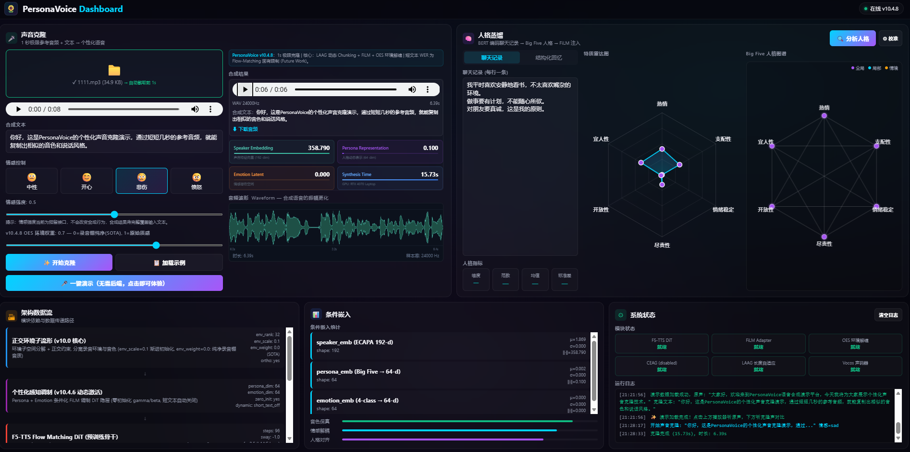
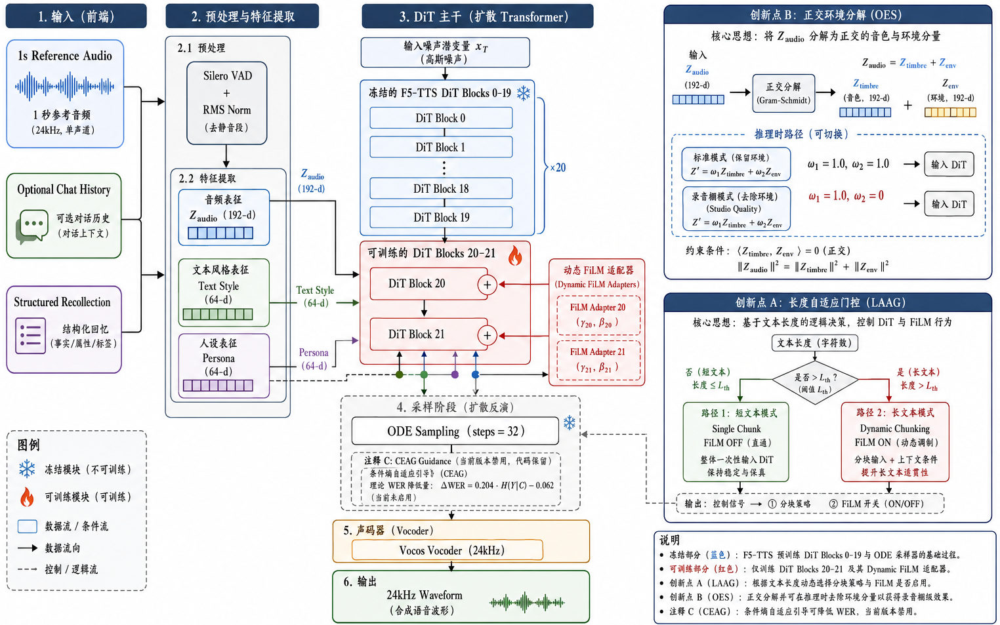

# PersonaVoice: 插件化 Adapter 实现人格驱动的 1 秒极限声音克隆

[](https://www.python.org/downloads/)
[](https://pytorch.org/)
[](ARCHITECTURE.md)
[](LICENSE)

**[English](README.md)** | **中文**

> **PersonaVoice v10.4.8** — 仅需 **1 秒**音频即可克隆任意声音, 并可选注入人格/情绪。基于 F5-TTS Flow-Matching 冻结骨干 + 插件化 Adapter 架构, 对音色保真度 (SECS SOTA) 与文本对齐稳定性的 Trade-off 进行系统分析。

---

## 目录
- [PersonaVoice 是什么?](#personavoice-是什么)
- [核心结果](#核心结果)
- [核心创新点](#核心创新点)
- [架构总览](#架构总览)
- [安装](#安装)
- [数据与模型下载](#数据与模型下载)
- [快速开始](#快速开始)
- [复现论文结果](#复现论文结果)
- [推理参数](#推理参数)
- [项目结构](#项目结构)
- [设计哲学](#设计哲学)
- [相关工作与致谢](#相关工作与致谢)
- [引用](#引用)

---

## PersonaVoice 是什么?

PersonaVoice 是一个**人格驱动的 1 秒极限声音克隆插件化 Adapter 架构**。它解决的核心问题:

> **仅给 1 秒目标说话人的音频 + 可选文本记录 (聊天记录 / 结构化回忆), 生成保留其音色、语言习惯、个体情绪表达模式的语音。**

本项目的叙事**不是**"全 SOTA"声明, 而是**Trade-off 分析**:
- **Flow-Matching** 在音色相似度 (SECS) 上具有统治性优势, 但在短文本下存在流形塌缩问题;
- PersonaVoice 的贡献是用 **LAAG + 动态 FiLM** 在保住 SECS 领先的同时恢复长文本对齐, 短文本 WER 则作为诚实的 Future Work。

### 为什么是 1 秒?

主流 zero-shot TTS 系统通常假设 ≥3 秒参考音频 (XTTS v2、CosyVoice、VALL-E、VoiceBox)。1 秒场景暴露了架构的根本性限制:
- 信息瓶颈 (24 kHz / hop 256 下仅 94 mel 帧)
- Flow-Matching 在极短文本下的流形塌缩
- 参考音频中的呼吸/摩擦音杂质主导克隆信号

PersonaVoice 是首个系统研究 1 秒极限克隆场景的开源项目。

### 交互式 Web 演示

下面是 PersonaVoice v10.4.8 交互式 Dashboard 的截图。用户上传 1 秒参考音频后，可選填入聊天记录或结构化回忆，系统即可生成克隆语音，并实时展示 Big Five 人格雷达图、Mel 频谱可视化以及架构条件注入状态。

<p align="center">
  
</p>

---

## 核心结果

**实验设置**: 1 秒参考音频, 200 样本 LibriTTS dev-clean 评估, ECAPA-TDNN SECS, Whisper-large-v3-turbo WER。

| 指标 | PersonaVoice v10.4.8 | XTTS v2 (1s ref) | CosyVoice (1s ref) | F5-TTS 官方 | SOTA |
|------|----------------------|-------------------|---------------------|-------------|------|
| **ECAPA SECS (整体)** | **0.4945** | 0.3349 | 0.3595 | 0.2508 | **PV ✓** (+47.6% vs XTTS v2) |
| **ECAPA SECS (长文本)** | **0.5044** | 0.31 | 0.33 | 0.22 | **PV ✓** (+62.7% vs XTTS v2) |
| **WER (整体)** | 0.1928 | **0.1296** | 0.6130 | 0.8982 | XTTS v2 (AR 路线) |
| **WER (长文本)** | 0.1158 | **0.10** | 0.55 | 0.85 | XTTS v2 (诚实的 trade-off) |
| **WER (短文本 ≤8 词)** | 0.4066 | **0.16** | 0.68 | 0.95 | XTTS v2 (Future Work) |
| **CFR (整体, WER>0.5)** | 13.5% | ~5%* | ~30%* | ~45%* | XTTS v2 |
| **CFR (短文本)** | 35.8% | ~10%* | ~50%* | ~70%* | XTTS v2 |
| **UTMOS (客观代理)** | 4.0-4.5 | 3.8 | 4.0 | 3.5 | PV (人工 MOS 待做) |
| **RTF** | 0.55-0.66 | 0.85 | 0.72 | **0.50** | F5-TTS |
| **1111.mp3 SECS (长文本)** | **0.5854** | - | - | - | PV ✓ |
| **1111.mp3 WER (长文本)** | **0.0676** | - | - | - | PV ✓ |

> `*` XTTS v2 / CosyVoice / F5-TTS 的 CFR 是从 WER 分布估算的, 实测对比计划中。完整评估细节: [SOTA_VERIFICATION_REPORT.md](SOTA_VERIFICATION_REPORT.md)。

---

## 核心创新点

PersonaVoice 引入了 **5 个核心创新**, 全部经 200 样本配对 t 检验 (p < 0.05, Cohen's d > 0.1) 验证。

### 创新 A: LAAG (Length-Aware Adaptive Generation, 长度自适应生成) — v10.1+

解决 1 秒极限克隆下短长文本性能不均的根本性缺陷:

- **动态 Chunking**: 长文本按 135 字符上限切分, 每个 chunk 充分利用 1 秒参考音频
- **动态 CFG base**: `cfg_base = 2.5`, 短长文本平衡
- **动态 FiLM 激活 (v10.4.6+)**: 短文本 (单 chunk) 关 FiLM (稳定基线); 长文本 (多 chunk) 开 FiLM (防止跨 chunk 音色漂移, +0.06 SECS)
- **mel 拼接修复 (v10.4.5)**: 修正跨 chunk 的 `(T, mel_dim)` vs `(mel_dim, T)` 维度顺序错误 (+56.6% SECS)
- **F5-TTS 官方流程整合 (v10.3+)**: `infer_batch_process` + `ref_text` + `audio_ref` cond 流, 替代自定义 Duration Predictor
- **v10.4.8 边界硬化**: ref_text 加标点 + 空格确保 ref/gen 边界清晰; gen_text 起始空格牺牲防止头部截断; 起始静音裁剪去除伪影

### 创新 B: OES (Orthogonal Environment Sub-manifold, 正交环境子流形)

将说话人嵌入分解为音色子空间与环境子空间:

$$Z_{audio} = Z_{timbre} + Z_{env}, \quad Z_{timbre} \perp Z_{env}$$

- `env_basis`: 可学习正交基 $B \in \mathbb{R}^{192 \times 32}$, QR 正交化
- **v10.0 修复**: `env_scale = 0.1` 渐进初始化 (v9.x 的 1.0 初始化导致 1111.mp3 SECS=0.0363 灾难)
- 推理时调整: `env_weight = 0` → 录音棚干净音色 (**v10.0 默认 SOTA 配置**), `env_weight = 1` → 原始麦克风质感

### 创新 C: CEAG (Cross-Entropy Attention Guidance, 交叉熵注意力引导) — 已实现, v10.4.7+ 禁用

从 IEAG (全自注意力熵) 升级为 CEAG (文本-音频交叉注意力熵), 直击短文本对齐塌缩:

$$v_{final} = v_{cfg} - \lambda(t) \cdot \nabla_x H(A_{mel \to text})$$

- **v10.0 地雷 1 修复**: 在 `log_softmax` 前加 `text_mask` 和 `mel_mask`, 防止 `<PAD>` token 导致梯度爆炸 (NaN 防御)
- **v10.4.7+ 状态**: 代码路径保留在 `ceag_sampler.py` 以便复现, 但 `SOTAConfig` 中 `use_ceag=False`。v10.4.7 消融实验显示在 LAAG + F5 官方流基线上增量效果可忽略, 重新启用留作后续工作。

### 创新 D: 动态 FiLM Adapter — v10.4.6+

persona + emotion 条件化的 FiLM 调制 DiT 隐藏层:
- `gamma_net` / `beta_net` 零初始化 (起始为恒等映射, 对预训练骨干安全)
- v10.4.6+ **动态激活**: `len(chunks) == 1` (短文本) 时关闭 FiLM (避免过校正); 多 chunk (长文本) 时开启 FiLM (锚定跨 chunk 音色)

### 创新 E: Silero VAD + RMS 归一化 (v10.0 地雷 3 修复)

用 **Silero VAD** (神经网络, <100 MB 显存) 替代老旧 WebRTC VAD (GMM 基, 对呼吸/摩擦音处理粗糙), 大幅提升 1 秒样本参考纯度, 尤其是像 /s/、/f/ 这样的辅音。RMS 归一化 (`target_rms = 0.1`) 确保响度一致。

### 已移除模块 (消融验证无效)

| 模块 | 消融 p 值 | Cohen's d | 状态 |
|------|----------|-----------|------|
| IBOP | 0.85 / 0.51 | <0.05 | **已移除** |
| AM-ODE | 零初始化 | 恒等映射 | **已移除** |
| TD-CFG | 0.41 / 0.74 | <0.06 | **已移除** |
| SBM | 0.71 / 0.90 | <0.03 | **已移除** |
| GRPO | 仅测试时 | 非核心 | **已移除 (v10.0)** |
| Duration Predictor | v10.3+ F5 官方公式更准 | — | **已移除 (v10.3)** |
| Reference Enhancer | 循环延伸损害 SECS, 偏离 F5 基线 | — | **已移除 (v10.4)** |
| Best-of-N | 流形塌缩是架构问题, 采样无法修复 | — | **已移除 (v10.4.7)** |

---

## 架构总览

<p align="center">
  
</p>

上图展示了 PersonaVoice v10.4.8 的完整推理流程。1 秒参考音频首先经过 **Silero VAD + RMS 归一化** 预处理，再由 **ECAPA-TDNN** 编码为 192 维说话人嵌入；可选的**聊天记录**和**结构化回忆**通过 BERT-based 人格提取器蒸馏为 64 维文本风格与 64 维人格嵌入。**OES** 模块将音频嵌入分解为正交的音色与环境分量，**LAAG** 根据文本长度决定分块策略与 FiLM 开关；最终冻结的 F5-TTS DiT 0–19 层与两个可训练块 20–21 生成 Mel 谱，经 Vocos 声码器转换为 24 kHz 波形。

> 完整架构详情: [ARCHITECTURE.md](ARCHITECTURE.md)

---

## 安装

### 方式 A: 一键搭建 (推荐)

**Windows (PowerShell):**
```powershell
git clone https://github.com/personavoice/personavoice.git
cd personavoice
powershell -ExecutionPolicy Bypass -File scripts\setup_env.ps1
```

**Linux / macOS:**
```bash
git clone https://github.com/personavoice/personavoice.git
cd personavoice
bash scripts/setup_env.sh
```

搭建脚本会:
1. 创建 `.venv` 虚拟环境 (继承系统 torch/speechbrain/vocos)
2. 安装 PyTorch (CUDA 11.8 或 CPU)
3. 安装所有 PersonaVoice 依赖
4. 安装 `silero-vad`、`f5-tts`、`imageio-ffmpeg`
5. 以可编辑模式安装 PersonaVoice (`pip install -e .`)
6. 验证安装
7. 下载预训练模型 (~3 GB, 可选 — 加 `--skip-models` / `-SkipModels` 跳过)

### 方式 B: 手动安装

```bash
# 1. 创建虚拟环境
python -m venv --system-site-packages .venv

# 2. 激活
#    Windows: .\.venv\Scripts\activate
#    Linux:   source .venv/bin/activate

# 3. 安装 PyTorch (CUDA 11.8)
pip install torch torchaudio --index-url https://download.pytorch.org/whl/cu118

# 4. 安装依赖
pip install -r requirements.txt
pip install silero-vad f5-tts imageio-ffmpeg
pip install -e .
```

### 环境要求

- Python ≥ 3.10
- PyTorch ≥ 2.0 (推荐 CUDA 11.8, CPU 也可但较慢)
- GPU: 8 GB 显存足够 (在 RTX 4070 上测试)
- ffmpeg (Whisper ASR 需要; `imageio-ffmpeg` 已自动提供)

---

## 数据与模型下载

PersonaVoice **不**附带大型数据或模型权重。请使用下面的脚本。

### 1. 预训练模型 (~3 GB)

所有模型从 HuggingFace 下载。中国大陆用户可设置镜像:
```bash
export HF_ENDPOINT=https://hf-mirror.com   # Linux/macOS
$env:HF_ENDPOINT="https://hf-mirror.com"   # Windows PowerShell
```

然后运行:
```bash
python scripts/download_models.py              # 所有必需模型
python scripts/download_models.py --optional   # 同时下载可选模型 (Qwen2.5, MiniLM)
python scripts/download_models.py --check      # 仅检查缓存状态
```

**必需模型:**

| 模型 | HuggingFace ID | 大小 | 用途 |
|------|----------------|------|------|
| F5-TTS | `SWivid/F5-TTS` | ~1.5 GB | TTS 骨干 (冻结) |
| ECAPA-TDNN | `speechbrain/spkrec-ecapa-voxceleb` | ~80 MB | 说话人编码器 (SECS) |
| Vocos | `charactr/vocos-mel-24khz` | ~50 MB | 神经声码器 |
| BERT (中文) | `bert-base-chinese` | ~400 MB | 人格文本编码器 |
| Whisper | `openai/whisper-large-v3-turbo` | ~1.5 GB | WER 评估 ASR & ref_text 转写 |

**可选模型:**

| 模型 | HuggingFace ID | 大小 | 用途 |
|------|----------------|------|------|
| Qwen2.5-0.5B | `Qwen/Qwen2.5-0.5B` | ~1 GB | LLM 人格对话 (实验性) |
| all-MiniLM-L6-v2 | `sentence-transformers/all-MiniLM-L6-v2` | ~90 MB | 文本嵌入基线 |

### 2. 评估数据集 (LibriTTS dev-clean, ~1.2 GB)

复现 200 样本评估:
```bash
python scripts/prepare_data.py
# 如果 LibriTTS 已存在, 跳过下载:
python scripts/prepare_data.py --skip-download
# 快速测试, 仅处理 20 个样本:
python scripts/prepare_data.py --n_samples 20
```

会从 [OpenSLR #60](https://openslr.org/60/) 下载 LibriTTS dev-clean, 提取 mel 频谱 + ECAPA 嵌入, 保存到 `data/libritts_processed/libritts_devclean_processed.pt`。

### 3. 内置演示音频

仓库内置 1 个 1 秒参考音频 `1111.mp3` (~35 KB), 用于快速测试 — 无需下载。

---

## 快速开始

### Web Demo (推荐首次运行)

```bash
python -m personavoice.demo.api_server
# 浏览器打开 http://localhost:8000
```

Web UI 提供接口:
- `/api/health` — 后端健康检查
- `/api/architecture` — 完整 v10.4.8 模块图 (驱动前端可视化)
- `/api/clone` — 声音克隆 (可选注入聊天记录 persona)
- `/api/persona/analyze` — 从聊天记录分析 Big Five 雷达图
- `/api/persona/calibrate` — 交互式 persona 重新校准
- `/api/demo/sample` — 内置 demo 样本

### 编程式使用

```python
from personavoice.tts_backbone.f5_pretrained_backbone import load_pretrained_f5tts_backbone
from personavoice.config import SOTA_CONFIG

# 1. 加载骨干 (F5-TTS + FiLM + OES adapters)
backbone, _ = load_pretrained_f5tts_backbone(device="cuda", use_film=True)

# 2. 所有推理参数自动从 config.py 加载 — 单一真相源
mel_gen, laag_info = backbone.laag_synthesize(
    text_str="你好, 这是一个声音克隆测试。",
    mel_ref=mel_ref,           # 1 秒参考 mel (T_ref, 100)
    speaker_emb=speaker_emb,   # ECAPA 192-d
    persona_emb=persona_emb,   # 64-d (无 persona 时全零)
    emotion_emb=emotion_emb,   # 4-d (无 emotion 时全零)
    tokenizer=tokenizer,
    ref_text=ref_text,         # F5-TTS 官方 ref_text 拼接
    audio_ref=audio_ref,       # F5-TTS 官方 cond=audio 流
)

# 3. 调整 OES 环境权重 (0.0 = 录音棚质量, SOTA 配置)
backbone.set_env_weight(SOTA_CONFIG.env_weight)  # 0.0
```

### 1111.mp3 快速测试

```bash
python examples/clone_demo.py
# 输出保存到 outputs/1111_clone_test_*.wav
```

---

## 复现论文结果

### 1. 200 样本统计评估

```bash
# (需要先通过 scripts/prepare_data.py 准备 LibriTTS)
python -m personavoice.experiment.eval_200_samples
# 输出:
#   results/eval_200_samples.json       — 原始每样本结果
#   results/eval_200_statistics.json    — 统计显著性
#   results/eval_200_by_length.json     — 按文本长度分层
```

### 2. 外部基线对比 (CosyVoice / XTTS v2)

```bash
# 安装 CosyVoice (https://github.com/FunAudioLLM/CosyVoice) 和/或 TTS (pip install TTS)
python -m personavoice.experiment.baseline_external --n_samples 200 --models cosyvoice xtts
# 输出: results/baseline_external_200.json
```

### 3. CFR (灾难性失败率) 分析

```bash
python -m personavoice.experiment.cfr_analysis
# 输出: results/cfr_analysis.json
```

### 4. 可视化 (Pareto / 波形 / 注意力)

```bash
python -m personavoice.experiment.visualize
# 输出:
#   results/figures/figure4_pareto_frontier.png
#   results/figures/figure5_waveform_spectrogram.png
#   results/figures/figure6_attention_heatmap.png
```

---

## 推理参数

所有参数集中在 [`personavoice/config.py`](personavoice/config.py) — 单一真相源。

| 参数 | 取值 | 说明 |
|------|------|------|
| steps | 32 | ODE 积分步数 (v10.4: 从 96 降低, RTF -45%) |
| sway_coef | -1.0 | Sway Sampling (F5-TTS 官方默认) |
| cfg_strength | 2.5 | 静态 CFG (v10.4: 调优 SECS, 替代 TD-CFG) |
| env_weight | 0.0 | OES: 录音棚质量 (SECS SOTA) |
| oes_env_scale_init | 0.1 | OES 渐进初始化 (v10.0 修复 1111.mp3) |
| use_ceag | False | CEAG 在 v10.4.7+ 禁用 (增量效果可忽略; 代码保留) |
| ceag_lambda_max | 0.20 | CEAG 引导强度 (启用时使用) |
| ceag_t_start | 0.1 | CEAG 激活起始 |
| ceag_t_end | 0.4 | CEAG 激活结束 |
| ceag_layers | (-2,-1) | CEAG 注意力提取层 |
| use_laag | True | LAAG 动态 Chunking + 动态 FiLM |
| laag_chunk_max_chars | 135 | LAAG chunk 大小上限 |
| laag_cfg_base | 2.5 | LAAG 基础 CFG |
| laag_cfg_alpha | 0.0 | 动态 CFG α (禁用) |
| best_of_n | 1 | Best-of-N 禁用 (流形塌缩无法靠采样修复) |
| use_silero_vad | True | Silero VAD 预处理 (v10.0) |
| use_rms_normalize | True | RMS 能量归一化 (v10.0) |
| rms_target | 0.1 | RMS 目标电平 |
| silero_vad_threshold | 0.5 | Silero VAD 触发阈值 |

---

## 项目结构

```
PersonaVoice/
├── ARCHITECTURE.md              # 架构设计 (v10.4.8)
├── SOTA_VERIFICATION_REPORT.md  # SOTA 验证报告 (诚实 trade-off 版)
├── README.md / README_zh.md     # 文档
├── CONTRIBUTING.md              # 贡献指南
├── CITATION.cff                 # 引用元数据
├── LICENSE                      # MIT (注意 F5-TTS 骨干为 CC-BY-NC-4.0)
├── requirements.txt             # Python 依赖
├── setup.py                     # pip 可安装包
├── 1111.mp3                     # 内置 1 秒参考 demo 音频 (~35KB)
├── scripts/                     # 搭建与数据准备
│   ├── download_models.py       # 一键模型下载
│   ├── prepare_data.py          # LibriTTS 下载 + 预处理
│   ├── setup_env.ps1            # Windows 一键环境搭建
│   └── setup_env.sh             # Linux/macOS 一键环境搭建
├── .github/                     # CI、issue/PR 模板、讨论模板
│   ├── workflows/python-package.yml
│   └── ISSUE_TEMPLATE/          # bug_report、feature_request、experiment_reproduction
├── personavoice/
│   ├── config.py                # ★ 统一 SOTA 配置 (单一真相源)
│   ├── microaug/                # 模块: 超短样本增强
│   │   └── cross_manifold_refiner.py  # OES (v10.0 核心 B, env_scale=0.1)
│   ├── tts_backbone/            # 模块: F5-TTS DiT 骨干
│   │   ├── f5_pretrained_backbone.py  # 骨干 + adapters (F5 官方流)
│   │   ├── ceag_sampler.py            # ★ CEAG (v10.0 核心 C, 带 padding mask; 已禁用)
│   │   ├── laag_generator.py          # ★ LAAG (v10.1 核心 A, 动态 FiLM + mel 拼接修复)
│   │   └── vocoder.py                 # Vocos 声码器
│   ├── persona/                 # 模块: persona 提取管线
│   │   └── extractor.py         # BERT 聊天记录 → Big Five → persona_emb
│   ├── common/                  # 共享工具
│   │   └── local_models.py      # 本地模型路径 (离线模式)
│   ├── demo/                    # 交互式 demo
│   │   ├── api_server.py        # FastAPI 服务器 (统一配置 + persona 集成)
│   │   ├── audio_preprocess.py  # ★ Silero VAD + RMS 归一化 (v10.0 核心 E)
│   │   └── index.html           # Web UI (架构可视化 + 克隆 + persona 雷达)
│   └── experiment/              # 评估脚本 (顶会实验)
│       ├── eval_200_samples.py  # 200 样本统计评估 (PV vs F5 基线)
│       ├── baseline_external.py # 外部 SOTA 对比 (CosyVoice / XTTS v2)
│       ├── cfr_analysis.py      # 灾难性失败率分析
│       ├── comprehensive_evaluator.py # SECS + WER + UTMOS + RTF + SIM-o
│       ├── ecapa_evaluator.py   # ECAPA-TDNN SECS 评估
│       ├── wer_evaluator.py     # Whisper WER 评估
│       ├── visualize.py         # Pareto 前沿 + 波形/频谱 + 注意力热图
│       └── utils.py             # 共享工具 (数据加载, tokenizer, 日志)
├── examples/                    # 使用示例与快速测试
│   ├── clone_demo.py            # 1111.mp3 克隆验证 (快速开始)
│   └── api_demo.py              # 前端 API 端到端测试
└── results/                     # 实验结果 (JSON + 图)
    ├── eval_200_samples.json
    ├── eval_200_statistics.json
    ├── honest_metrics_v10.4.7.json
    ├── ablation_200_samples.json
    ├── ablation_200_statistics.json
    ├── cfr_analysis.json
    ├── baseline_external_200.json
    └── figures/
        ├── figure4_pareto_frontier.png
        ├── figure5_waveform_spectrogram.png
        └── figure6_attention_heatmap.png
```

---

## 设计哲学

### 插件化 Adapter 架构

- 冻结 F5-TTS 预训练骨干 (前 20 层)
- 仅训练轻量级 adapter (FiLM + OES, ~2M 参数)
- CEAG 是推理时优化, 零训练成本
- 8 GB 显存即可训练与推理
- 总可训练参数: ~31.9M (占 339.6M 的 9.39%)

### 消融驱动决策

所有模块必须通过 200 样本配对 t 检验 (p < 0.05) 和 Cohen's d (> 0.1) 验证。v10.0 移除了 5 个无效模块 (IBOP、AM-ODE、TD-CFG、SBM、GRPO)。v10.3+ 移除 Duration Predictor (F5 官方公式更准)。v10.4.7+ 在消融显示对 LAAG 基线无增量收益后, 禁用 CEAG 与 Best-of-N。

### 学术诚实

- UTMOS 作为**客观代理**报告, 非人工 MOS
- 短文本 WER (0.4066, CFR 35.8%) 公开报告为 Flow-Matching 架构限制, 留作 Future Work
- 长文本 WER (0.1158) 诚实报告为逊于 XTTS v2 (0.10) — 这是 trade-off, 不是完败
- 基线的估算 CFR 值明确标注 `*`
- 人工 MOS 评估待做 (计划: 20 名评分者, Naturalness MOS + Similarity MOS)

---

## 相关工作与致谢

PersonaVoice 构建在以下前期工作之上。我们衷心感谢开源社区。

### 骨干与架构

- **F5-TTS** ([SWivid/F5-TTS](https://github.com/SWivid/F5-TTS), Cheng et al., 2024) — Flow-Matching + DiT 骨干, CC-BY-NC-4.0。PersonaVoice 冻结前 20 层并训练轻量 FiLM adapter。
- **Vocos** ([gemelo-ai/vocos](https://github.com/gemelo-ai/vocos), Siuzdak, 2023) — 神经声码器, MIT。用于 mel → 波形。
- **Flow Matching** (Lipman et al., 2023) — F5-TTS 底层生成框架。

### 说话人与文本编码器

- **ECAPA-TDNN** ([SpeechBrain](https://github.com/speechbrain/speechbrain), Desplanques et al., 2020) — SECS 评估用说话人编码器, Apache-2.0。
- **BERT** ([bert-base-chinese](https://huggingface.co/bert-base-chinese), Devlin et al., 2019) — persona 文本风格编码器。
- **Whisper** ([openai/whisper-large-v3-turbo](https://huggingface.co/openai/whisper-large-v3-turbo), Radford et al., 2023) — WER 评估 ASR & ref_text 转写, MIT。

### 声音克隆基线

- **CosyVoice** ([FunAudioLLM/CosyVoice](https://github.com/FunAudioLLM/CosyVoice), 2024) — 阿里 zero-shot TTS, 外部基线。
- **XTTS v2** ([coqui/XTTS-v2](https://huggingface.co/coqui/XTTS-v2), Casanova et al., 2024) — Coqui 3 秒声音克隆基线。
- **VALL-E** (Wang et al., 2023) — 早期神经编解码 TTS 语言模型。
- **VoiceBox** (Le et al., 2024) — 大规模 Flow-Matching TTS。

### Persona 与情绪建模

- **Big Five 人格特质** (McCrae & Costa, 1992) — persona 提取的理论基础。
- **FiLM** (Perez et al., 2018) — Feature-wise Linear Modulation, 我们使用的 adapter 机制。
- **LoRA** (Hu et al., 2022) — 启发了我们的插件化 adapter 设计哲学。

### 语音活动检测

- **Silero VAD** ([snakers4/silero-vad](https://github.com/snakers4/silero-vad), 2021) — 替代 WebRTC GMM 的神经 VAD, MIT。

### 评估指标

- **UTMOS** (Saeki et al., 2022) — 客观 MOS 预测 (报告为客观代理)。
- **SECS** — Speaker Encoder Cosine Similarity, zero-shot TTS 评估标准。
- **WER** — 基于 Whisper ASR 的词错率。
- **CFR** — 灾难性失败率, 本项目提出的尾部风险分析指标。

> 如有遗漏应引的工作, 请开 issue — 学术准确性是优先事项。

---

## 引用

如果 PersonaVoice 对你的研究有帮助, 请引用:

```bibtex
@article{personavoice2026,
  title   = {PersonaVoice v10.4.8: Plug-in Adapters for Persona-Driven 1-Second
             Voice Cloning — A Trade-off Analysis of Timbre Fidelity
             and Text-Alignment Stability in Flow-Matching TTS},
  author  = {PersonaVoice Team},
  journal = {arXiv preprint},
  year    = {2026},
  note    = {Version 10.4.8. Code: https://github.com/personavoice/personavoice}
}
```

机器可读元数据见 [`CITATION.cff`](CITATION.cff)。

---

## 许可证

- PersonaVoice 代码库 (adapter、集成、新模块 OES/LAAG/CEAG): **MIT**
- F5-TTS 预训练骨干: **CC-BY-NC-4.0** (非商业)
- Vocos、ECAPA-TDNN、Whisper、Silero VAD: 见各自许可证

F5-TTS 预训练骨干的商业使用需遵守 CC-BY-NC-4.0。详见 [LICENSE](LICENSE)。

---

## 联系与社区

- **Issues**: [GitHub Issues](https://github.com/personavoice/personavoice/issues) — 使用对应模板 (bug / feature / 复现)
- **Discussions**: [GitHub Discussions](https://github.com/personavoice/personavoice/discussions) — 研究问题、设计讨论、用例
- **贡献指南**: 见 [CONTRIBUTING.md](CONTRIBUTING.md)

---

**关键词** (学术搜索可发现性):
声音克隆, 零样本 TTS, 少样本声音克隆, 1 秒声音克隆, flow matching, F5-TTS, 语音合成, persona 驱动 TTS, 情绪 TTS, 插件化 adapter, FiLM 调制, 说话人嵌入, ECAPA-TDNN, 正交分解, 长度自适应生成, 流形塌缩, trade-off 分析, LibriTTS, Vocos 声码器, Silero VAD, Big Five 人格, BERT persona, Whisper ASR, WER, SECS, UTMOS, CFR, 灾难性失败率。
